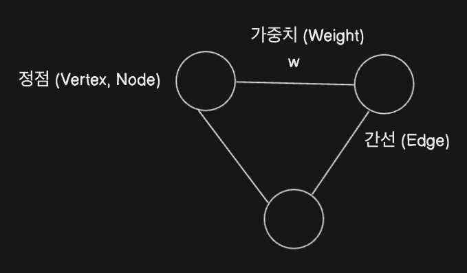
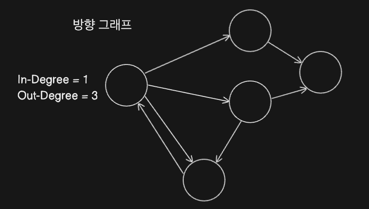
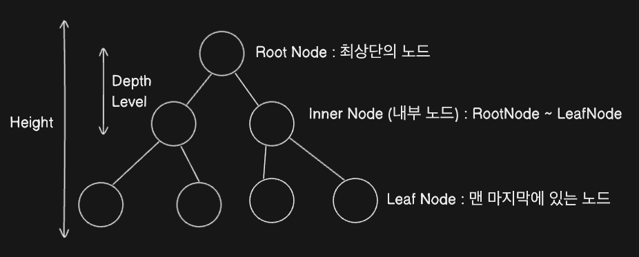

# 그래프 Graph

## 1. 그래프의 구성요소

## 2. 방향(Directed) 그래프와 양방향(Non-Directed) 그래프

# 트리 Tree

## 1. 트리의 특징

-   트리는 자식노드와 부모노드로 갖는 **계층적** 구조를 가짐
-   트리는 **사이클이 존재하지 않음**
-   트리는 주로 **무방향 그래프임**
-   트리도 **그래프** 의 한 종류임

     

-   E(간선 수) = V(노드 수) - 1
-   임의의 두 노드 사이의 경로(최단)는 '유일무이' 하게 '존재' 함  
    트리 내부의 어떤 노드와 어떤 노드 사이의 경로는 반드시 존재하고 하나 밖에 없다!

 

-   깊이 (Depth) : 루트 노드에서 특정 노드까지 최단 거리로 갔을때의 거리
-   높이 (Height) : 루트 노드에서 리프 노드까지의 거리중 가장 긴 거리

## 2. 이진 트리와 이진 탐색 트리

이진 트리 : 각각의 노드와 자식 수가 2개 이하로 구성되어 있는 트리

-   정이진 트리 (Full Binary Tree) : 자식 노드가 0 또는 2개인 이진 트리

-   완전 이진트리 (Complete Binary Tree) : 왼쪽에서 부터 채워져 있는 이진 트리
